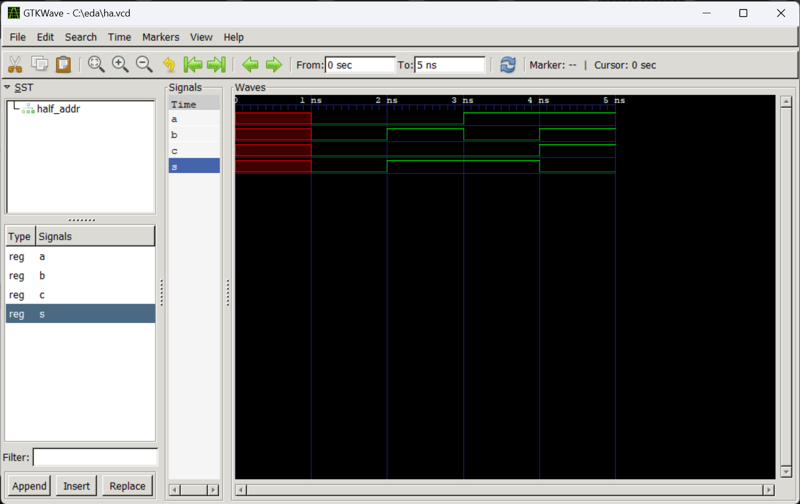
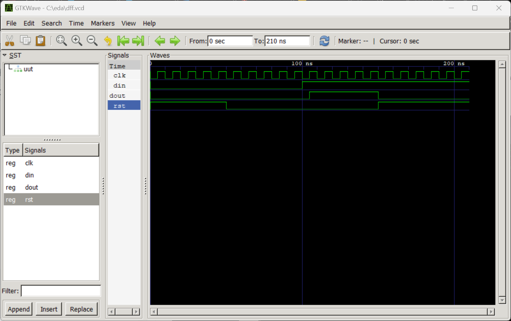

# Lab 1

## Installs
I found the installation instructions in the dsd repo, and utilized the links there to download GHDL and GTKWave. I was able to find the correct files for Windows after a few minutes of looking. After downloading the ZIPs, I extracted them and moved them to a new "eda" folder in "C:\" on my computer. Lastly, I added their locations to Path and then was ready to go.

## Running
I downloaded the example files from the dsd repo and ran them in GTKWave. After the files were open I displayed the signals and adjusted the timebase so you could see the entire signal in the window.

## Output
### Half Adder

### D Flip-Flop

