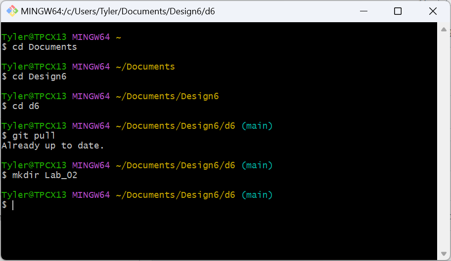
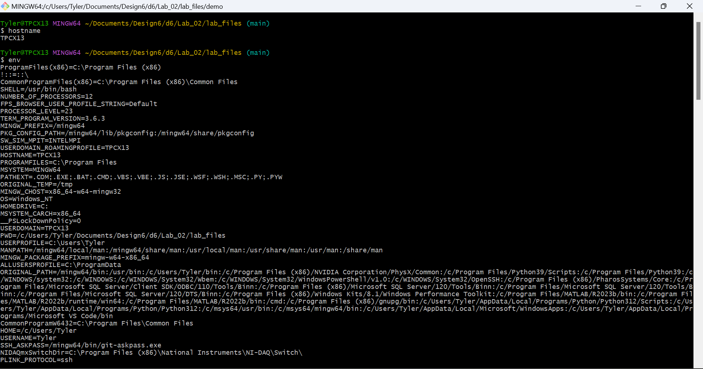
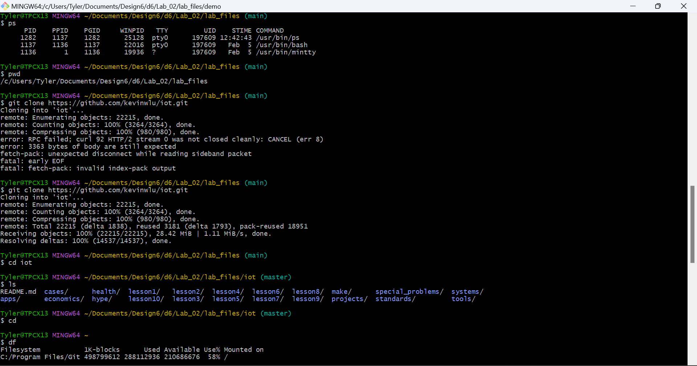
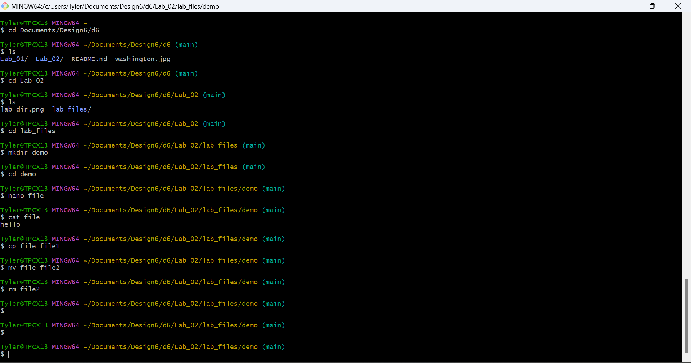
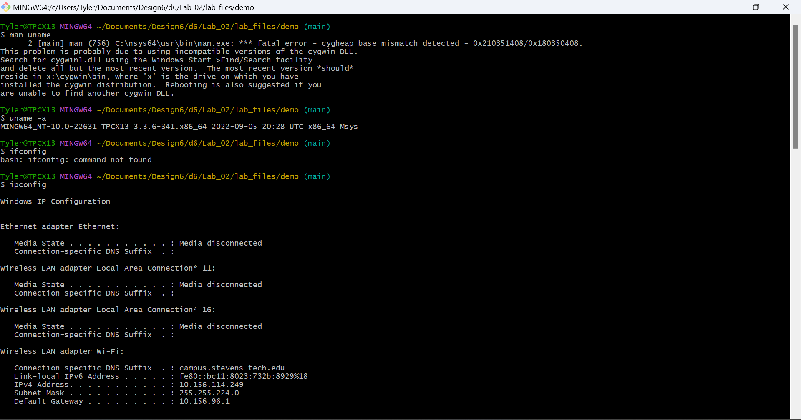
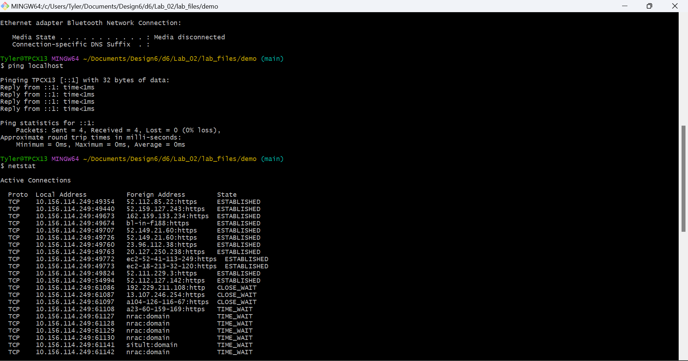
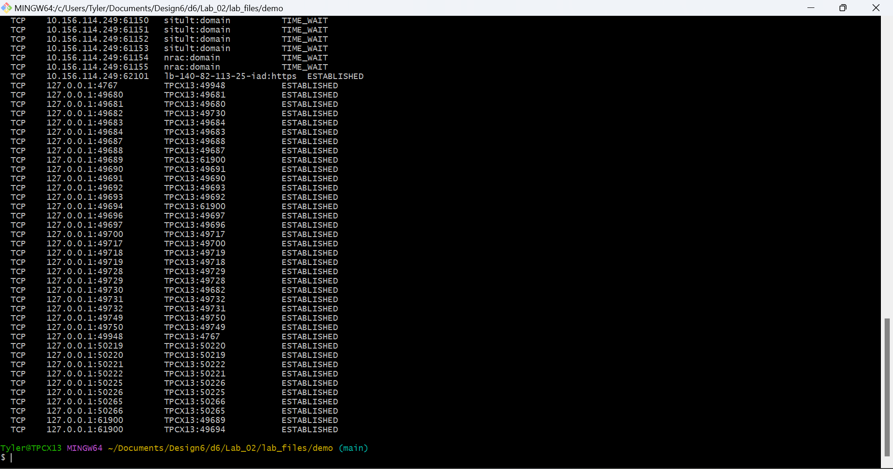

# Lab 2

I did this lab on a Windows computer. For the terminal, I used Git Bash since that is usually what I use for pull and pushing repos. I started off by making this folder.

I then ran all the commands in the lab instructions. For some reason the iot repo didn't clone the first time, but then I just tried it again and it worked. When I ran the `ifconfig` command it came back as not found, which I recognized was just because of Windows so I then ran the correspding command `ipconfig`. I then took the output screenshots and then pushed them here.

