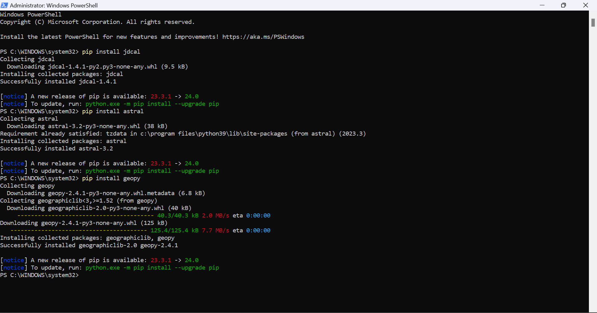
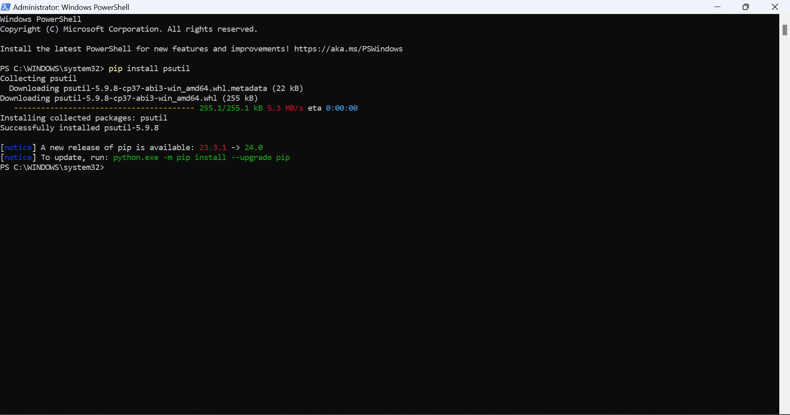
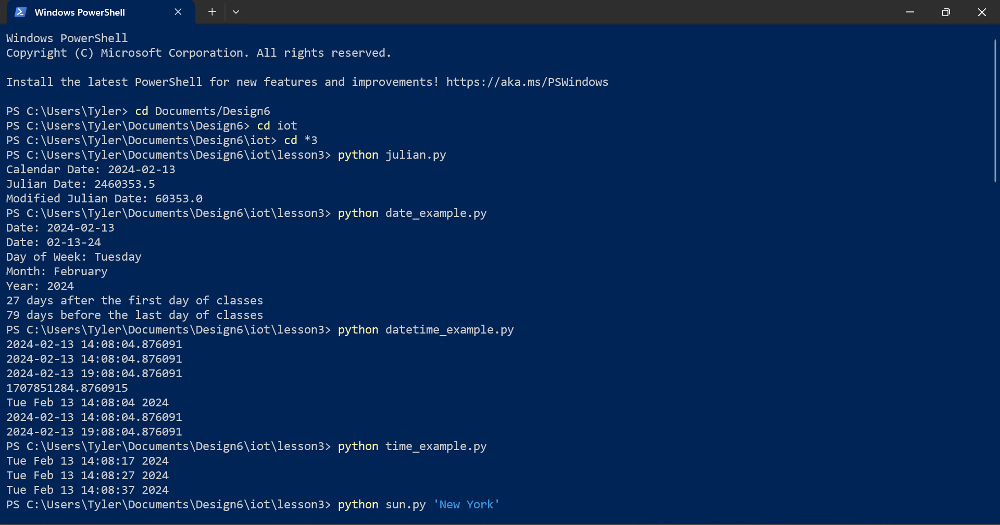
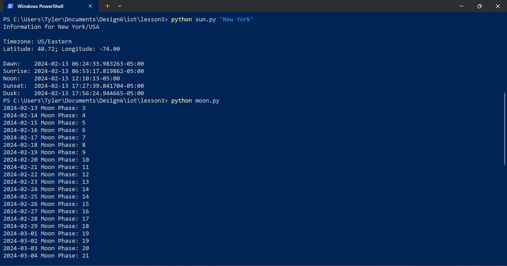
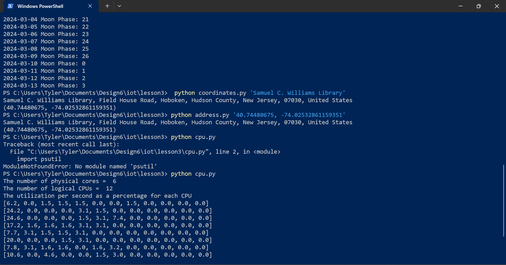
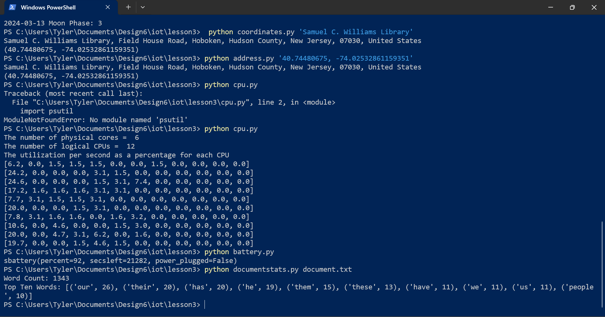

# Lab 3

I did this entire lab in Windows PowerShell. I first started off by installing the required packages using pip in a PowerShell window as admin. After that I opered a new regular PowerShell window and navigated to the correct directory. When I initially started running the python scripts, I was getting module not found for the packages. I ran `pip list` to check that they were installed, and they were all there. I figured out that this issue was actually due to the wrong version of the python interpreter running (I have far too many versions of python installed), which I was able to check with `python3 --version`. I then checked `python --version` which yielded the correct version, 3.9.x, so I continued the rest of the lab omitting the '3' when running the scripts.

The only other issue I had was another module not found when I got to `cpu.py`, since it needed `psutil`, but I just went back and installed it and everything worked fine.

## Output

