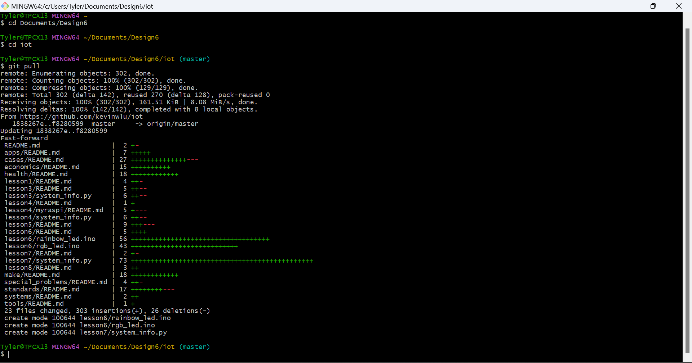
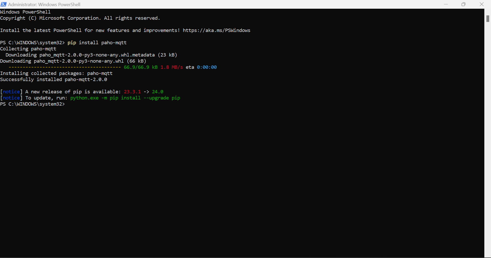
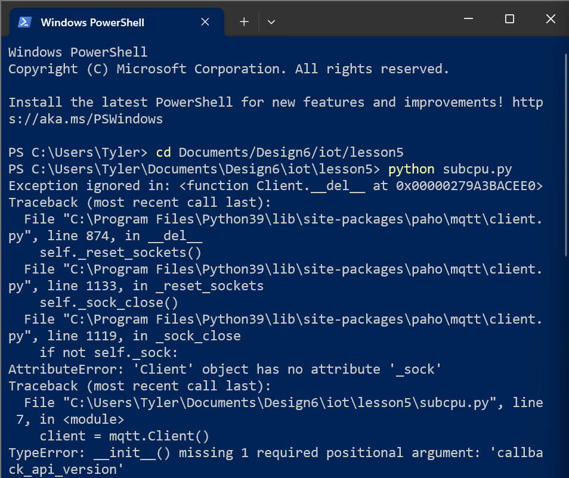
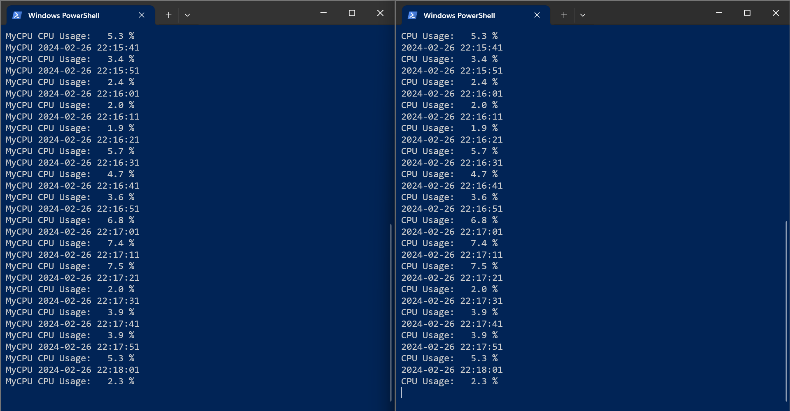

# Lab 5

I first started off by pulling the latest version of the iot repo.

I then went ahead and installed Paho-MQTT.

When I first ran the programs, I revieced this error saying it was missing an argument for the api version in the `mqtt.Client()` function call.

Luckily after a few minutes of looking online, I found that the source of the issue is a recent (early Febuary 2024) update to Paho-MQTT. I found the [migrations page](https://github.com/eclipse/paho.mqtt.python/blob/v2.0.0/docs/migrations.rst) which said to simply add `mqtt.CallbackAPIVersion.VERSION1` as the first argument in the `Client()` call. And finally...

## Output

