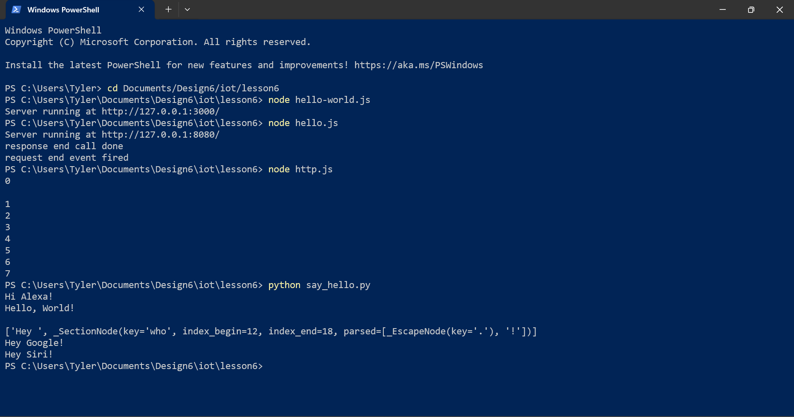

# Lab 6

I installed the required packages by downloading Node.js from the website, and the running the msi. Then I opened PowerShell, I used pip to install Pystache the usual way I do it.

I then ran all the js files in PowerShell, and then viewed the output in a browser. Finally, I ran the lone python script in the same PowerShell window.

## Output

### hello-world.js

### hello.js

### http.js

### PowerShell Window and Python Output

