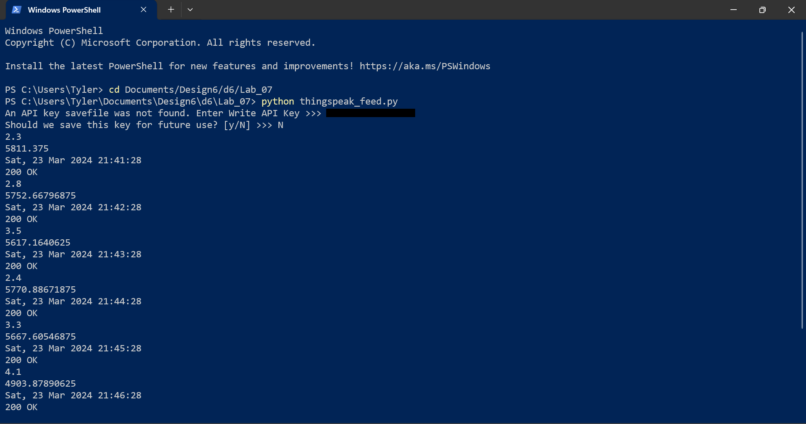
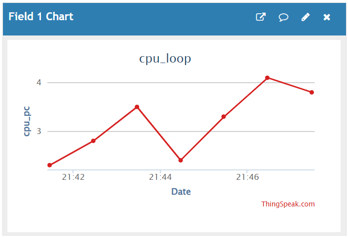
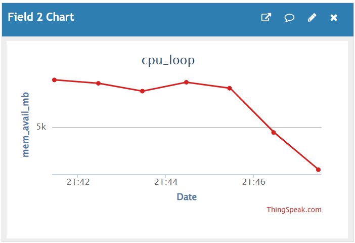
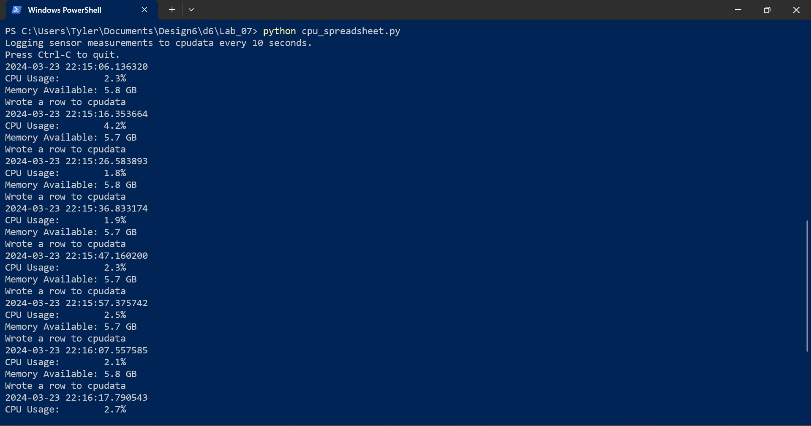
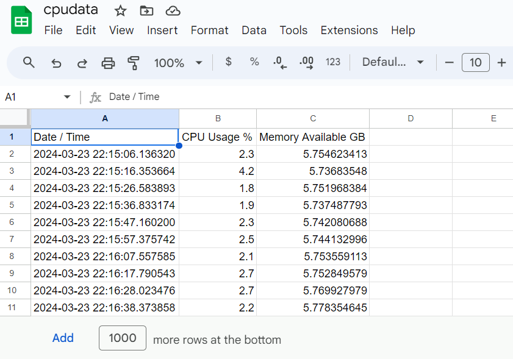

# Lab 7

## ThingSpeak

I started off by signing into ThingSpeak and generating an API key. Then I copied the `thingspeak_feed.py` file over to my lab folder and ran it, providing the key.

I let it run for a few minutes, and then checked back in on ThingSpeak to see the output graphs.

## Sheets

I logged into the Google Cloud IAM and followed the instructions to generate the key and download the json. The wording of the instructions wasn't always the same as what was on the buttons to be clicked, but after a few minutes I was able to figure it out. I then installed gspread and oauth2client in PowerShell, and copied the `cpu_spreadsheet.py` file over to my lab folder where I had saved the json. After that, I created the sheet in Google Sheets, shared it with the client_email address,gave it the proper headers and deleted the unused rows. I then went back to edit the python script, adding the json file name and the name of the Google Sheet. I was then ready to run the python script.

